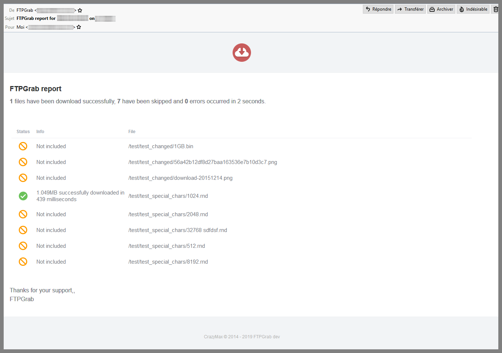

# Mail notifications

Notifications can be sent through SMTP.

## Configuration

!!! example "File"
    ```yaml
    notif:
      mail:
        host: localhost
        port: 25
        ssl: false
        insecureSkipVerify: false
        from: ftpgrab@example.com
        to: webmaster@example.com
    ```

| Name                  | Default       | Description   |
|-----------------------|---------------|---------------|
| `host`[^1]            | `localhost`   | SMTP server host |
| `port`[^1]            | `25`          | SMTP server port |
| `ssl`                 | `false`       | SSL defines whether an SSL connection is used. Should be false in most cases since the auth mechanism should use STARTTLS |
| `insecureSkipVerify`  | `false`       | Controls whether a client verifies the server's certificate chain and hostname |
| `username`            |               | SMTP username |
| `usernameFile`        |               | Use content of secret file as SMTP username if `username` not defined |
| `password`            |               | SMTP password |
| `passwordFile`        |               | Use content of secret file as SMTP password if `password` not defined |
| `from`[^1]            |               | Sender email address |
| `to`[^1]              |               | Recipient email address |

!!! abstract "Environment variables"
    * `FTPGRAB_NOTIF_MAIL_HOST`
    * `FTPGRAB_NOTIF_MAIL_PORT`
    * `FTPGRAB_NOTIF_MAIL_SSL`
    * `FTPGRAB_NOTIF_MAIL_INSECURESKIPVERIFY`
    * `FTPGRAB_NOTIF_MAIL_USERNAME`
    * `FTPGRAB_NOTIF_MAIL_USERNAMEFILE`
    * `FTPGRAB_NOTIF_MAIL_PASSWORD`
    * `FTPGRAB_NOTIF_MAIL_PASSWORDFILE`
    * `FTPGRAB_NOTIF_MAIL_FROM`
    * `FTPGRAB_NOTIF_MAIL_TO`

## Sample



[^1]: Value required
