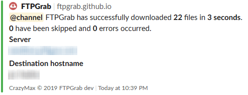

# Slack notifications

You can send notifications to your Slack channel using an [incoming webhook URL](https://api.slack.com/messaging/webhooks).

!!! hint
    Mattermost webhooks are compatible with Slack notification without any special configuration (if Webhooks are enabled).

## Configuration

!!! example
    ```yaml
    notif:
      slack:
        enable: true
        webhook_url: https://hooks.slack.com/services/ABCD12EFG/HIJK34LMN/01234567890abcdefghij
    ```

| Name               | Default       | Description   |
|--------------------|---------------|---------------|
| `enable`[^1]       | `false`       | Enable slack notifications |
| `webhook_url`[^1]  |               | Slack [incoming webhook URL](https://api.slack.com/messaging/webhooks) |

## Sample



[^1]: Value required
